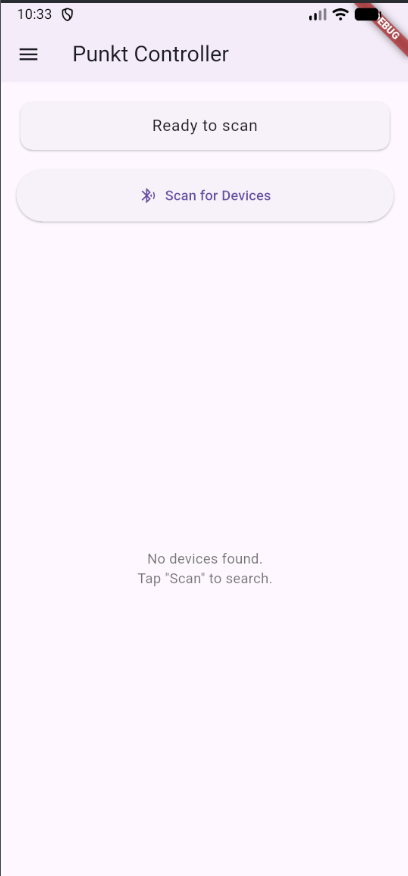
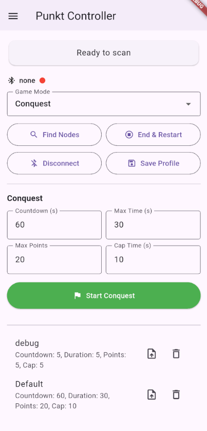
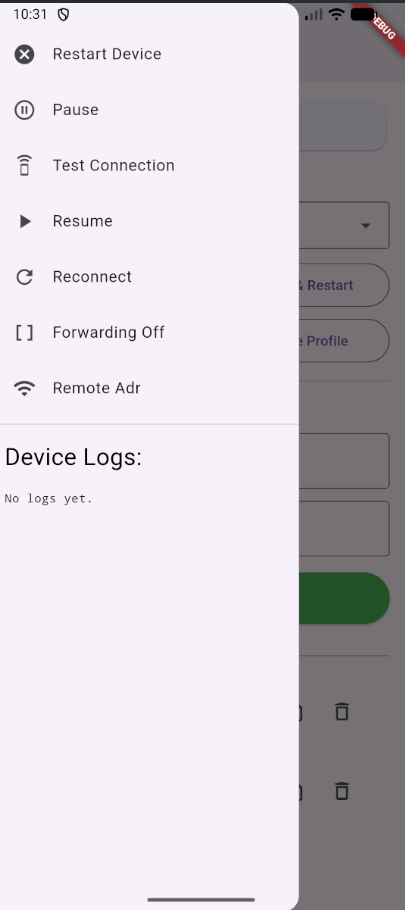

# Dokumentacja dla projektu SPAS GAME SYSTEM

## Przydatne linki

Kod źródłowy aplikacji:
[Github](https://github.com/morzechowicz/Airsoft-Connected-Control-Points)

Kod źródłowy aplikacji Android:
[Github](https://github.com/morzechowicz/ACCP-android-app)

## Co to jest?
Jest to projekt „prostego" systemu rozgrywek w stylu przejmowania punktów (kto grał w podbój w BF-ie, ten wie, o co chodzi).
Gracze mogą kontrolować punkt poprzez naciśnięcie (przytrzymanie) przycisku w kolorze swojej drużyny. Gra odbywa się do momentu, w którym skończy się czas lub jedna drużyna zdobędzie maksymalną liczbę punktów.
Urządzenia działają na podstawie jednego centralnego punktu, który przelicza wszystko i aktualizuje pozostałe. Sama komunikacja odbywa się poprzez LoRa, natomiast programowanie gry odbywa się z poziomu aplikacji na Androida.

## Przykładowy przebieg gry

0. Gracze czekają na swoich respawnach na start, organizator konfiguruje urządzenie i rozpoczyna odliczanie.

1. Odliczanie dobiega końca, urządzenia wydają z siebie sygnał startowy (jeden długi sygnał). Gra się rozpoczyna.

2. W czasie gry gracze zdobywają urządzenia poprzez przytrzymanie przycisku w kolorze swojej drużyny przez czas określony w konfiguracji.

3. Każde urządzenie wydaje sygnał lokalizacyjny audio (jeden krótki). Im mniej czasu do końca gry, tym szybciej sygnał jest nadawany.

4. Gra może zostać przerwana (dwa długie sygnały). Następnie może zostać wznowiona (jeden długi sygnał).

5. Grę kończy uzyskanie przez jedną drużynę wymaganej liczby punktów, skończenie się czasu lub zdalne zakończenie gry przez organizatora.

## Konfiguracja gry

#### Skrócona wersja

0. Rozstaw urządzenia.
1. Połącz urządzenia za pomocą „Find Nodes".
2. Przygotuj konfigurację (czas gry, odliczanie, maksymalne punkty, czas przejmowania) i rozpocznij odliczanie.

#### Pełna wersja krok po kroku

0. Kompletacja urządzeń i podłączenie anten, głośników itp.
1. Podłączenie urządzeń do zasilania (LiPo 11,1 V lub powerbank, w zależności od urządzenia).
2. Test łączności i sprawności urządzeń. Jeżeli jakieś urządzenie nie wykona poprawnie testu, należy je odłączyć lub naprawić.
3. Rozstawienie urządzeń w docelowych miejscach.
4. Test łączności na miejscu docelowym. Jeżeli jakiekolwiek urządzenie nie ma połączenia z serwerem na poziomie co najmniej 80% dostarczonych pakietów, należy zmienić jego pozycję.
5. Dodanie pozostałych urządzeń do serwera poprzez funkcję „Find Nodes".
6. Przygotowanie parametrów konfiguracji gry: maksymalny czas, czas odliczania, maksymalne punkty, czas przejmowania.
7. Rozpoczęcie odliczania poprzez wysłanie danych konfiguracyjnych na serwer.
8. Po ukończeniu odliczania serwer rozsyła pakiet rozpoczęcia gry. Jeżeli jakieś urządzenie nie otrzyma tego pakietu, automatycznie wyśle zapytanie do serwera o ponowny przesył. Jeżeli ponowne zapytanie nie pomoże, urządzenie wyświetli błąd i będzie wymagało interwencji administratora.
9. Przebieg rozgrywki: czas ucieka, punkty są zdobywane, urządzenia są przejmowane.
10. Koniec gry: wysłanie do pozostałych urządzeń informacji o końcu gry. Informacja ta jest wysyłana do każdego urządzenia osobno, dlatego może nastąpić opóźnienie pomiędzy poszczególnymi punktami.
11. Ponowna rozgrywka — zaczynając od pkt 6.
12. Zakończenie pracy urządzeń poprzez odłączenie ich od źródła zasilania.

## Funkcje aplikacji mobilnej i jej omówienie

### Ekran skanowania urządzeń

Ekran pozwala na wyszukiwanie urządzeń i wybieranie, do którego z nich chcemy się podłączyć.
Do tej pory wszystkie urządzenia mają w nazwie „SPAS".

Rozpocznij skan, klikając przycisk „Scan for devices".
Następnie kliknij wybrane urządzenie, co przeniesie cię do ekranu połączenia z urządzeniem.

### Ekran połączenia z urządzeniem

Główny ekran, na którym znajdują się wszystkie funkcjonalności potrzebne do obsługi gry.

1. **Game mode:** pozwala wybrać tryb gry — domyślnie KOTH.
Poniżej znajdują się 4 przyciski obsługi podstawowej:
   - **Find Nodes:** wysyła sygnał do pozostałych urządzeń w celu dodania ich do gry.
   - **End & Restart:** ustawia czas gry na maksymalny, przez co kończy grę.
   - **Disconnect:** wychodzi z menu urządzenia z powrotem do wyszukiwarki.
   - **Save Profile:** zapisuje wartości podane w polach, aby można je było łatwo wczytać później.

2. Pola konfiguracji gry. W przyszłości mogą być zależne od trybu, ale ponieważ mamy jeden tryb, są one następujące:
   - **Countdown:** odliczanie do startu gry w sekundach (zalecam nie mniej niż 5 × liczba urządzeń, aby konfiguracja przebiegła poprawnie).
   - **Max Time:** maksymalna długość trwania gry w minutach.
   - **Max Points:** maksymalna liczba punktów do uzyskania przez daną drużynę.
   - **Cap(ture) time:** czas przejmowania punktu w sekundach.

3. **Start KOTH:** przycisk do uruchomienia sekwencji gry.
Sekwencja rozpoczyna się odliczaniem, a po jego upływie rozpoczyna się gra sygnalizowana jednym długim sygnałem dźwiękowym.

4. **Zapisane wartości:** w dolnej cześci ekranu pozwalają na szybkie wybranie wcześniej zapisanej konfiguracji gry. 

### Ekran boczny

Ekran pomocniczy.

- **Restart device:** wysyła do wszystkich urządzeń rozkaz restartu (łącznie z nadawcą).
- **Pause:** zatrzymuje grę.
- **Test Connection:** pozwala na wykonanie testu połączenia z wszystkimi urządzeniami.
W polu potwierdzenia należy wprowadzić liczbę urządzeń, pomijając urządzenie, z którego wysyłamy sygnał (np. mam 3 paczki i chcę przetestować sygnał — łączę się z paczką nr 1 i podaję liczbę testowanych jako 2).
Test może zająć trochę czasu, w zależności od liczby urządzeń i jakości sygnału.
Wszystkie wyniki i problemy zostają wyświetlane w polu poniżej.
- **Resume:** pozwala na wznowienie gry (jeżeli jakiś punkt nie wznowi gry, można klikać do skutku).
- **Reconnect:** funkcja testowa pozwalająca na przywrócenie do gry punktu, który uległ awarii i został zresetowany, lub punktu dodanego do gry w trakcie jej trwania.
- **Forwarding Off / Forwarding to X:** pozwala na przekazywanie rozkazów poprzez sieć LoRa do oddalonych urządzeń, gdzie X to adres punktu docelowego. **UWAGA:** jeżeli opcja jest włączona, aktualnie podłączone urządzenie będzie ignorować wszystkie rozkazy i jedynie przesyłać je do punktu docelowego.
- **Remote Address:** pozwala ustawić punkt docelowy.
- **DeviceLogs:** podgląd zdarzeń na urządzeniu. Działa tylko wtedy, gdy jest podłączone do jakiegoś punktu — w innym razie logi przepadają.

## Porady dotyczące rozstawiania urządzeń

### Urządzenia muszą się „widzieć"
Pomimo znacznego zasięgu urządzenia będą miały problem z nadawaniem, jeżeli pomiędzy nimi znajdują się duże przeszkody w postaci budynków lub wzniesień.
Najlepiej przed grą wykonać test, jak urządzenia radzą sobie w danym terenie.

### Każdy punkt musi widzieć serwer lub przekaźnik, który widzi serwer
Zasada działania opiera się na topologii gwiazdy. Jest jeden serwer, który wie wszystko, i to on przekazuje swoje informacje dalej. Dlatego tak ważne jest, aby urządzenia mogły komunikować się konkretnie z nim.
Ewentualnie można skorzystać z przekaźnika, który powtarza wiadomości od i do serwera.

### Testowanie połączenia wygląda następująco

Po połączeniu z urządzeniem wykonującym test (najlepiej znajdującym się w miejscu, skąd widać pozostałe) wybieramy opcję „Test Connection". Następnie podajemy liczbę urządzeń minus jeden i wybieramy OK.

Teraz następuje testowanie połączenia — jego przebieg można śledzić w panelu bocznym.
Test łączności polega na tym, że na początku wysyłany jest sygnał broadcast, a następnie nasłuchiwane są odpowiedzi. Broadcast jest wysyłany do czasu, aż odpowie przewidywana liczba urządzeń — w innym przypadku następuje timeout i test jest przerywany. Należy wtedy rozpocząć od nowa.

Po uzyskaniu sygnału od wszystkich urządzeń następuje test bezpośredni. Tester wysyła zapytanie do każdego urządzenia po kolei i oczekuje na odpowiedź. Jeżeli jej nie uzyska, przechodzi do następnego urządzenia. Robi tak 5 razy dla każdego sprzętu, a następnie wyświetla wyniki. Najważniejsze wyniki to liczba odpowiedzi (najlepiej 5/5), siła sygnału RSSI i SNR.

Im mniejsza wartość RSSI, tym lepiej (−90 to wartość uzyskiwana, gdy urządzenia praktycznie stykają się antenami, −30 to norma). SNR to poziom zakłóceń, które występowały podczas nadawania. Im mniej, tym lepiej, ale wysoka wartość też nie stanowi problemu, jeżeli uzyskano 5/5 odpowiedzi.

## Rodzaje urządzeń

Cały projekt opiera się na oprogramowaniu, które może działać inaczej na każdym urządzeniu, w zależności od potrzeb. Na przykład urządzenie może być punktem, który czynnie bierze udział w grze, lub informatorem, który tylko wyświetla statystyki.

Rodzaj urządzenia wybierany jest podczas jego programowania.

### Punkt

Podstawowy typ urządzenia i jedyny wymagany do rozgrywki.
Zawiera podstawowe oprogramowanie do kontroli przynależności oraz może pełnić funkcję serwera kontrolującego grę (na jedną grę może przypadać tylko jeden serwer).
Jego funkcje to:
- Wyświetlanie wyników i stanu punktu.
- Przyciski do przejmowania punktu.
- Głośnik do sygnalizacji audio.

Jedno takie urządzenie wystarczy, aby rozpocząć grę, ale można połączyć ich więcej.

### Informator

Urządzenie służące do wyświetlania wyników.
Posiada duży ekran, na którym wyświetlane są dane takie jak czas gry, punkty i przejęte urządzenia.

Nie bierze udziału w rozgrywce i nie może być przejmowane.

### Przekaźnik

Proste urządzenie typu relay, którego zadaniem jest nasłuchiwanie i przekazywanie dalej pakietów LoRa. Pozwala na większą elastyczność w rozstawieniu punktów względem serwera.

### Konwerter BLE na LoRa

Urządzenie do zdalnego programowania. Dzięki niemu administrator może przygotować grę, będąc nawet daleko od punktu serwera.

### Headless

Urządzenie obsługujące wyłącznie serwer.
Wymaga do gry przynajmniej jednego punktu.

## Budowa urządzeń

Urządzenia „punkt" i „informator" mają wymagania co do posiadanych peryferiów. Pozostałe urządzenia mogą być zbudowane dowolnie, tak długo jak zawierają podstawowe komponenty, czyli ESP32 i moduł LoRa.

### Punkt

MUSI posiadać:
- ESP32 i moduł LoRa,
- jeden ekran LCD 16×2,
- dwa przyciski z diodą LED (najlepiej niebieski i żółty),
- MOSFET sterujący buzzerem,
- buzzer,
- przetwornicę step-down do 5 V,
- zasilanie o napięciu 12 V.

### Informator

MUSI posiadać:
- ESP32 i moduł LoRa,
- jeden ekran LCD 20×4,
- buzzer,
- zasilanie o napięciu 5 V.

Pozostałe elementy, takie jak obudowa, są dowolne i według uznania składającego. Zalecam jednak zainstalowanie ochrony ekranu w postaci panelu z poliwęglanu.

## Wytłumaczenie działania

Sekcja ta jest przydatna przy rozwiązywaniu preblemów.
Zostanie przedstawiona tutaj głównie logika działania klienta i serwera działających na punktach.

### Serwer:
Jest najważniejszą częścia systemu. Odpowiada za synchronizację, komunikację, śledzenie parametrów gry i obsługe wydarzeń.
W czasię gry zawsze może być tylko jeden serwer.
Punkt zostaje serwerem w momencie przesłania do niego konfiguracji z aplikacji.
Jeżeli w czasie gry Serwer straci zasilanie lub zostanie zrestarttowany nie będzie możliwe odzyskanie stanu gry.
Serwer rozpoczyna działanie w momencie startu odliczania. Wysyła on sygnał z konfiguracją za pomocą broadcastu. Jeżeli któryś z klinetów nie otrzyma konfiguracji rozpocznie on process samo naprawy i zapyta serwer o konfigurację.
Można też ręcznie uruchomić ten process za pomocą "Reconnect" w bocznym menu.
W trakcie gry serwer otrzymuje informację o tym czy punkt został przejęcy oraz co 60 sekund aktualizuje stan gry i wysyła ten update do klinetów. 
Po spełnieniu jednego z warunku końca gry. Serwer wysyłą informację o zakończeniu osobno do każdego z klientów. Jeżeli jakiś klient nie otrzyma tej wiadomości trzeba go zrestartować.

### Klient
Program klienta może zostać uruchomiony na dowolnym punkcie i może działać obok serwera.
Każdy punkt który bieże udział w rozgrywce ma oprogramowanie klienta. Klient odpowiada tylko za kontrollę przycisków oraz wyświetla informację od serwera.
Każdy klient może się połaczyć do już istniejącej gry za pomocą "Reconnect" z menu bocznego.
Klient który przez 2 minuty nie otrzymał update od serwera zacznie wysyłać do niego bezpośrednie zapytanie o status.

### Połączenie LoRa

System działa w topologi gwiazdy. Serwer jest centralnym punktem z którym komunikują się pozostałe. Oznacza to że serwer musi mieć widok (Połączenie) z wszystkimi aktywnymi urządzeniami. 
Dlatego właśnie zaleca się umiejscowienie go gdzieś wysoko tak aby był widoczny z każdego punktu.
Komunikacja między punktami jest ograniczona do minimum. Serwer jest jedynym punktem który nadaje duża ilość pakietów ze względu na jego specyfikę. Klient jest w tym miejscu ograniczony tylko do najważniejszych zdażeń. Moduł Informatora z kolei nie nadaje nic tylko nasłuchuje wydarzeń.

### Rodzaje przesyłu danych

Informację mogą być przesyłane w trybie broadcast (do wszystkich bez potwierdzenia) lub w trybie unicast (bezpośrednie na dany adres z oczekiwaniem na potwierdzenie). Istnieje też hybryda tych rozwiązań kiedy to jest wysyłany broadcast po czym punkty które przechwyciły broadcast wysyłają już pakiet unicast do nadawcy.
Tak działa np: Find Nodes
Serwer wysyła zapytanie na adres rozgłoszeniowy po czym klienci zgłaszają się do niego jeden po drugim bezpośrednio.

## Tryby gry

Podane poniżej tryby gry to tylko sugestie. Urządzenia zostały zaprogramowane z tymi trybami w zamyśle ale nic nie stoi na przeszkodzie aby zmieniać zasady.

### tryb KOTH

#### obsługiwane urządzenia:
- Punkt
- Informator

#### opis:
Tryb wymaga jednego serwera i jednego lub wielu klientów. 
Przejmowanie punktów odbywa się poprzez przytrzymanie przycisku przez zaprogramowany czas.
Przejmowanie ma ustawione pół sekundy luzu czyli czas przez który puszczenie przycisku nie spowoduje zatrzymania przejmowania.
Jest to jednocześnie deboucing oraz zabezpiczenie przed przypadkowym puszczeniem przycisku w trakcie przejmowania.
Punkty naliczane są co interwał (60 sekund) wtedy to serwer zlicza ile punktów jest przejęte przez jaką drużyne i na tej podstawie dodaje wynik.
Na przykład: Drużyna niebieska kontroluje jeden punkt a drużyna żółta dwa punkty. Serwer zliczy to jako jeden punkt dla niebieskich i dwa dla żółtych.
Gra kończy się po upływie czasu lub gdy jedna drużyna uzyska wymagany wynik. Remis jest możliwy.

Tryb jest przeznaczony na gry różnej wielkości, z możliwością respienia / medyków. Zalecane granie na większym obszaże.

### WORK IN PROGESS
****************
### Tryb Defuse 

#### obsługiwane urządzenia:
- Punkt
- Informator

#### opis:

Tryb polega na obronie i ataku jednego z dwóch punktów (nazywanych dalej bombsite, b-site, bs).
Atakujący muszą w krótkim czasie na przynajmniej jednym z punktów aktywować odliczanie. Broniący mają do tego nie dopuścić. Jeżeli atakującym się uda role się odwracają. Teraz to atakujący nie mogą pozwolić obrońcom na przerwanie odliczania. 
Atakujący wygrywają jeżeli rozpoczną i doprowadzą do skutku odliczanie.
Broniący wygrywają jeżeli skończy się czas lub zatrzymają odliczanie.
Obie strony mogą wygrać po przez eliminację przeciwnika.

Tryb przeznaczony na mniejszy teren, mniejszą ilość graczy, szybkie rozgrywki, brak respów.
(gramy na mapie de_łaczki2 XD)

### Tryb Flaga 

#### obsługiwane urządzenia:
- Punkt

#### opis:

****************
### WORK IN PROGRSS

## Problemu i sposoby na radzenie sobie znimi

### Gra się rozpoczyna ale tylko na jednym punkcie

Upewnij się że urządzenia widzą się nawzajem.
Zrestartuj urządzenia i połącz je za pomocą "find nodes"
Dopiero teraz wgraj konfigurację i rozpocznij grę.

### Na jednym z urządzeń wyświetla się informacja o błędzie przy starcie

Połącz się z urządzeniem za pomocą aplikacji i wybierz opcję "Reconnect"

#### Reszta rozwiązań w trakcie badań

## Wgrywanie kodu źródłowego

Napiszę kiedyś na pewno.

Tego to już na pewno nikt nie przeczyta.

## Budowa i instalacja aplikacji na Android

Lmao, tego tym bardziej.

## Ciekawostki

Przygotowanie kodu zajęło mi zbyt wiele czasu.

Kiepsko dobrany buzzer potrafi brzmieć jak ptak.

Nieważne, jak bardzo coś jest idiotoodporne — ktoś i tak się pomyli.

Tokyo Marui MWS to najlepsza replika M4 GBBR.

## Koniec

Instrukcja przygotowana dla SPAS Podkarpacie.
Nie ponoszę odpowiedzialności za wszystko, co tutaj napisałem.
Z kodu i urządzeń korzystasz na własną odpowiedzialność.

Podziękowania dla wszystkich zaangażowanych w testy i obsługę projektu.

###### Napisane przez Tetrich